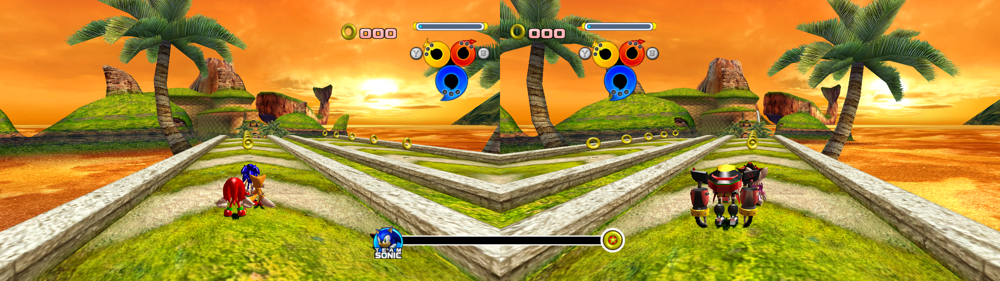

	<h1>Heroes Essentials: Graphics</h1>
	
	   
	<strong>Hey Dream</strong>
    <p">I need you to help me 
    put a cringy line here."

<b>Id: sonicheroes.essentials.graphics</b>

# Table of Contents
- [About This Project](#about-this-project)
  - [Features](#features)
      - [Widescreen & Tallscreen Support](#widescreen-tallscreen-support)
      - [Fast Stage Load Times](#fast-stage-load-times)
      - [Other Features](#other-features)
  - [How to Use](#how-to-use)

# About This Project

The following project is a [Reloaded II](https://github.com/Reloaded-Project/Reloaded-II) Mod Loader mod that provides a set of essential features for running Sonic Heroes in 2019, mainly in the graphics department.

## Widescreen & Tallscreen Support

Normally Sonic Heroes only allows you to use a few hardcoded resolutions, all constrained to the 4:3 aspect ratio. Graphics Essentials meanwhile allows you to use both play the game in wide and tall screen modes.

## Fast Stage Load Times

*Enabled by default*

Normally the game has to wait until the titlecards finish playing to allow you to start the level. 
Graphics Essentials allows you to bypass that wait.

## Other Features

- Uncapping 2P Framerate: *2P is no longer limited to 30FPS!*  
- Custom Window Styles: *Resizable & Borderless Windows*  
- High Aspect Ratio Crashfix: *Normally when running on very wide resolutions such as 5760x1080, the game would crash when loading a stage. Not anymore.*  
- Complete Launcher Replacement: *The configuration file for this mod replaces the game's settings file completely.*  

## Acknowledgements

[Aperture by Martin Chapman Fromm from Noun Project](https://thenounproject.com/browse/icons/term/aperture/)